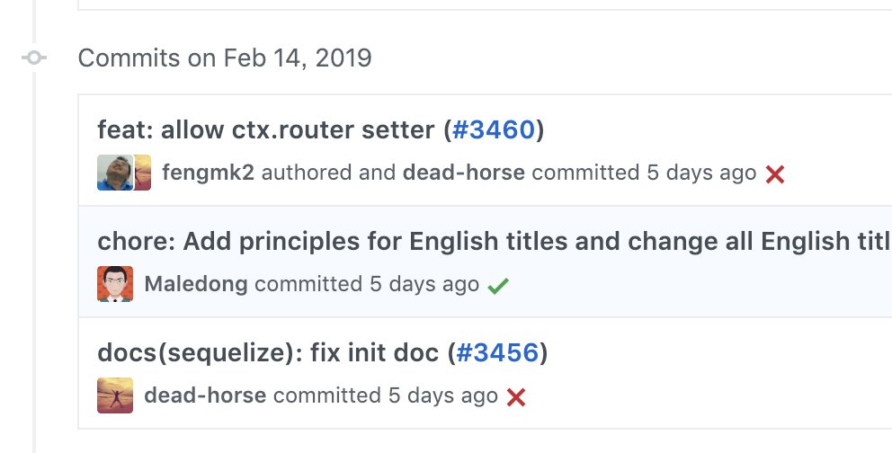
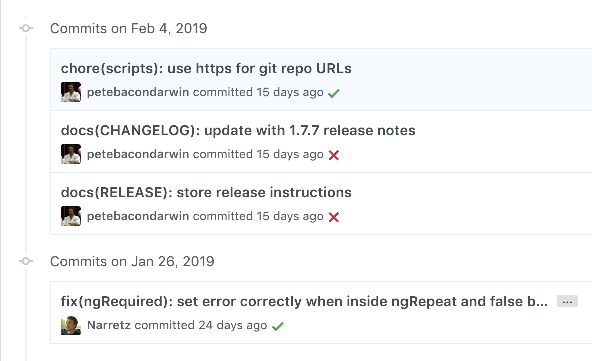

## git commit 提交规范

### 参考

- [Commit message 和 Change log 编写指南](http://www.ruanyifeng.com/blog/2016/01/commit_message_change_log.html)

### commit message 格式

```
<type>(<scope>): <subject>
// 空一行
<body>
// 空一行
<footer>
```

### 示例

- [egg.js](https://github.com/eggjs/egg/commits/master)
  
- [angular](https://github.com/angular/angular.js/commits/master)
  

### type 类型

| type     | 解释                           | 示例                                                         |
| -------- | ------------------------------ | ------------------------------------------------------------ |
| feat     | feature，新功能                | feat: 新增历史记录查询功能                                   |
| fix      | 修复 bug                       | fix: 修复查询按钮无法响应的 bug。(可附上 JIRA 上的 bug 链接) |
| docs     | 文档变更                       | docs: 增加 readme.md                                         |
| style    | 样式变更                       |                                                              |
| format   | 代码格式变更（不影响代码运行） |                                                              |
| refactor | 代码重构                       |                                                              |
| deps     | 依赖变更/升级                  | deps: 升级依赖库                                             |
| chore    | 构建工具变更                   |                                                              |
| perf     | 性能优化                       |                                                              |
| test     | 增加测试                       |                                                              |
| revert   | 撤销某次提交                   |                                                              |
